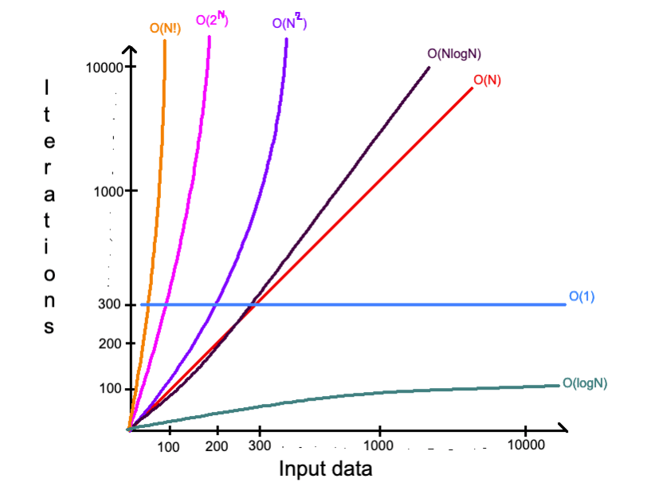

# Алгоритмы и структуры данных

```
TC - Time Complexity
SC - Space Complexity
```

**Структура данных** — это способ организации данных. В зависимости от того, какими данными мы хотим манипулировать и что с ними делать, — должны выбрать ту или иную структуру данных, которая идеально подходит для нашего случая.

**Алгоритм** — это последовательность действий, которая будет выполнена для достижения цели при манипулировании входными данными. Алгоритм может отличаться в зависимости от того, какую структуру данных мы выбираем. Почти всегда есть возможность решить проблему несколькими способами, применяя различные алгоритмы. Какие-то будут эффективными, а другие — неэффективными.

Именно поэтому крайне необходимо иметь возможность оценить эффективность алгоритма по сравнению с другими, чтобы точно определить, какой лучше. Эта оценка называется — **Сложность алгоритма**.

## Сложность алгоритма и Big O

**Сложность алгоритмов** — это оценка работы алгоритма. Используется для сравнения с другими, которые приводят к одному и тому же результату. В программировании важны два ключевых фактора сравнения — время и память.

В обоих случаях сложность зависит от входных данных: список из 10 клиентов отработает быстрее и займет меньше памяти, чем аналогичный из 100 000. Причем точное время никого не интересует: это зависит от языка программирования, типа данных, процессора и многого другого. Важна только сложность при стремлении размера входных данных к бесконечности (асимптотическая сложность) — то есть, как будет расти расход ресурсов (времени и памяти) с увеличением входных данных.

Следить за ростом и в сравнении расхода ресурсов поможет понятие «Big O» (О-нотация, как ее называют). О пришла в IT-мир из математики, но я на этом сейчас не буду останавливаться. Для нас достаточно сказать, что **Big O** — это описание верхнего возможного предела.

## О(1) — Константная сложность (Constant)

**Алгоритм имеет О(1) сложность** — когда известно, сколько точно раз что-то произойдет, или сколько памяти будет выделено, независимо от изменения входных данных. То есть, алгоритм всегда будет использовать одинаковое количество ресурсов. Это наилучшая возможная сложность, к которой нужно стремиться.

## О(N) — Линейная сложность (Linear)

TC — количество итераций = количество элементов.

SC — если нужно создать массив из N элементов, то это будет O(N) SC.

## О(log N) — Логарифмическая сложность (Logarithmic)

Многие алгоритмы имеют логарифмическую сложность — бинарный поиск (Binary Search), поиск в сбалансированном бинарном дереве поиска (Balanced Binary Search Tree), и многих других. Причиной этого является его эффективность, которая намного лучше чем О(N).

Простой «lifehack», как понять, что алгоритм имеет O(logN) — когда на каждом шаге количество элементов уменьшается вдвое, то это скорее всего O(log N).

## О(N\*N) — Квадратичная сложность (Quadratic)

Это популярная сложность для некоторых алгоритмов сортировки и классическая при работе с матрицей (двумерный массив).

## О(NlogN) — Линейно-логарифмическая сложность (Linearithmic)

Эта сложность немного медленнее линейной, но значительно быстрее квадратичной. Применяется преимущественно в эффективных алгоритмах сортировки — слиянием (Mergesort), быстрая сортировка (Quicksort), другие.

## O(2^N) — Экспоненциальная сложность (Exponential)

Чаще всего алгоритмы с этой сложностью встречаются в рекурсии, динамическом программировании и т. д.

## O(N!) — Факториальная сложность (Factorial)

Факториал — это умножение всех целых чисел, больших 0 и не превышающих самих себя.

Например: `5! = 5*4*3*2*1 = 120.`

Как можно догадаться — очень стремительно растет.



## Бинарный поиск (Binary Search)

Бинарный поиск — тип поискового алгоритма, который последовательно делит пополам заранее отсортированный массив данных, чтобы обнаружить нужный элемент. Другие его названия — двоичный поиск, метод половинного деления, дихотомия.

### **Принцип работы алгоритма бинарного поиска**

Основная последовательность действий алгоритма выглядит так:

1. Сортируем массив данных;
2. Делим его пополам и находим середину;
3. Сравниваем срединный элемент с заданным искомым элементом;
4. Если искомое число больше среднего — продолжаем поиск в правой части массива (если он отсортирован по возрастанию): делим ее пополам, повторяя пункт 3. Если же заданное число меньше — алгоритм продолжит поиск в левой части массива, снова возвращаясь к пункту 3.

### **В каких случаях используют бинарный поиск**

Двоичный поиск подходит для нахождения позиций элемента в упорядоченном списке: в этом случае он эффективнее линейного, поскольку массив данных на каждом шаге разделяется надвое и одна половина сразу отбрасывается. Последовательная сложность двоичного метода в худшем и среднем случаях равна `O(log n)`, в лучшем — `O(1)` (если обнаруживаем искомый элемент на первой итерации). Для сравнения: вычислительная сложность линейного поиска равна `O(n)` (обычный проход по всем элементам в поисках нужного).

У бинарного поиска есть недостаток — он требует упорядочивания данных по возрастанию. Сложность сортировки — не менее `O(n log n)`. Поэтому, если список короткий, используется все-таки линейный поиск.

## Сортировка выбором (Selection Sort)

Сортировка выбором – возможно, самый простой в реализации алгоритм сортировки. Как и в большинстве других подобных алгоритмов, в его основе лежит операция сравнения. Сравнивая каждый элемент с каждым, и в случае необходимости производя обмен, метод приводит последовательность к необходимому упорядоченному виду.

### **Сортировка массива выбором осуществляется так:**

1. Находим номер минимального значения в неотсортированной части массива;
2. Производим обмен этого значения со значением первой неотсортированной позиции (обмен не нужен, если минимальный элемент уже находится на данной позиции);
3. Продолжаем сортировку оставшегося списка, исключив из рассмотрения еще один элемент.

Худшее время: `O(n²)`

## Сортировка пузырьком (Bubble Sort)

Самый простой, но не самый эффективный алгоритм.

### **Принцип работы**

На каждом шаге мы находим наибольший элемент из двух соседних и ставим этот элемент в конец пары. Получается, что при каждом прогоне цикла большие элементы будут всплывать к концу массива, как пузырьки воздуха — отсюда и название.

### **Алгоритм выглядит так:**

1. Берём самый первый элемент массива и сравниваем его со вторым. Если первый больше второго — меняем их местами с первым, если нет — ничего не делаем;
2. Затем берём второй элемент массива и сравниваем его со следующим — третьим. Если второй больше третьего — меняем их местами, если нет — ничего не делаем;
3. Проходим так до предпоследнего элемента, сравниваем его с последним и ставим наибольший из них в конец массива. Всё, мы нашли самое большое число в массиве и поставили его на своё место;
4. Возвращаемся в начало алгоритма и делаем всё снова точно так же, начиная с первого и второго элемента. Только теперь даём себе задание не проверять последний элемент — мы знаем, что теперь в конце массива самый большой элемент;
5. Когда закончим очередной проход — уменьшаем значение финальной позиции, до которой проверяем, и снова начинаем сначала;
6. Так делаем до тех пор, пока у нас не останется один элемент.

Эффективность работы пузырьковой сортировки равна `O(n²)`.

## Быстрая сортировка (Quick Sort)

### **В чём идея быстрой сортировки**

Когда в 1960 году Тони Хоар придумывал этот алгоритм, ему нужно было отсортировать данные на магнитной ленте за один проход, чтобы не перематывать плёнку много раз. Для этого он взял за основу классическую пузырьковую сортировку и преобразовал её так:

1. На очередном шаге выбирается опорный элемент — им может быть любой элемент массива.
2. Все остальные элементы массива сравниваются с опорным и те, которые меньше него, ставятся слева от него, а которые больше или равны — справа.
3. Для двух получившихся блоков массива (меньше опорного, и больше либо равны опорному) производится точно такая же операция — выделяется опорный элемент и всё идёт точно так же, пока в блоке не останется один элемент.

### **Особенности алгоритма**

Так как на третьем шаге мы разбиваем массив на два и для каждой части делаем то же самое, и так снова и снова, то это значит, что в нём используется рекурсия. Рекурсия — это когда функция вызывает саму себя, и при этом ей нужно держать в памяти все предыдущие этапы. Это значит, что при использовании сразу двух рекурсий (для левой и правой частей массива), может потребоваться очень много памяти. Чтобы обойти это ограничение, используют улучшенные версии быстрой сортировки.

### **Выбор опорного элемента**

Правильный выбор опорного элемента может сильно повысить эффективность быстрой сортировки.
Вне зависимости от того, какой элемент выбран в качестве опорного, массив будет отсортирован, но все же наиболее удачным считается ситуация, когда по обеим сторонам от опорного элемента оказывается примерно равное количество элементов.

Худшее время: `O(n²)`.

Среднее время: `O(n log n)`.
